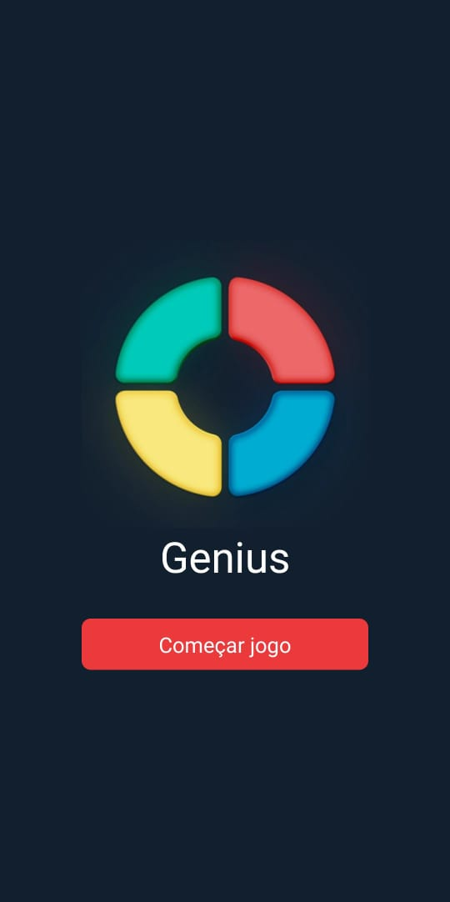

# Genius game

## Descrição

O projeto proposto é a implementação de um jogo Genius utilizando React Native, uma estrutura de desenvolvimento de aplicativos móveis. O Genius é um jogo clássico de memória e habilidade que desafia os usuários a repetirem sequências de cores e sons cada vez mais longas

## Stack utilizada

React Native

  
  
  

